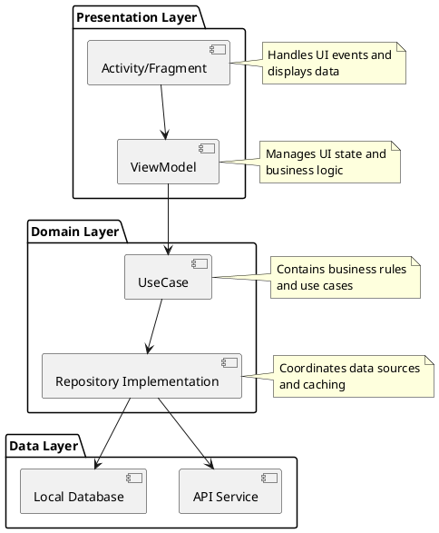
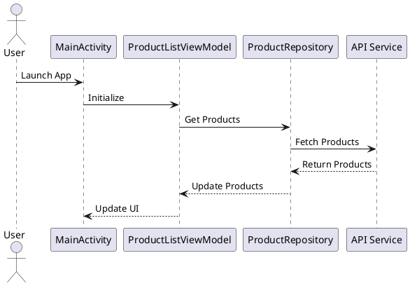
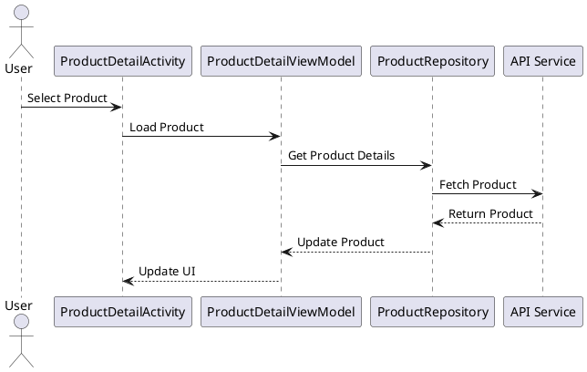
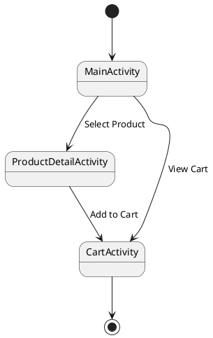

# Architecture Documentation

## Overview

The application follows the MVVM (Model-View-ViewModel) architecture pattern, which is part of the Android Architecture Components. This architecture provides a clean separation of concerns and makes the app more maintainable and testable.

## Architecture Diagram



## Component Details

### 1. Presentation Layer

#### Activities
- `MainActivity`: Main entry point, displays product list
- `ProductDetailActivity`: Shows detailed product information
- `CartActivity`: Manages shopping cart

#### ViewModels
- `ProductListViewModel`: Manages product list state
- `ProductDetailViewModel`: Manages product details state
- `CartViewModel`: Manages shopping cart state

### 2. Domain Layer

#### Use Cases
- `GetProductsUseCase`: Fetches product list
- `GetProductDetailsUseCase`: Fetches single product details
- `AddToCartUseCase`: Adds product to cart

#### Repository Interfaces
- `ProductRepository`: Defines product data operations
- `CartRepository`: Defines cart operations

### 3. Data Layer

#### Repositories
- `ProductRepositoryImpl`: Implements product data operations
- `CartRepositoryImpl`: Implements cart operations

#### Data Sources
- Remote: Fake Store API
- Local: Room Database

## Data Flow

1. **Product List Flow**


2. **Product Detail Flow**


## Navigation Flow



## Dependency Injection

The app uses manual dependency injection for simplicity. Each component is responsible for creating its dependencies:

```kotlin
class ProductListViewModel(
    private val repository: ProductRepository
) : ViewModel() {
    // ViewModel implementation
}
```

## Error Handling

The app implements a consistent error handling strategy:

1. **Network Errors**
   - Retry mechanism with exponential backoff
   - Offline caching
   - User-friendly error messages

2. **Data Validation**
   - Input validation in ViewModels
   - Data sanitization in Repositories

3. **UI Error States**
   - Loading states
   - Error states
   - Empty states

## Testing Strategy

### Unit Tests
- ViewModel tests
- Repository tests
- Use case tests

### Integration Tests
- Repository integration tests
- API integration tests

### UI Tests
- Activity tests
- Fragment tests
- Navigation tests

## Performance Considerations

1. **Image Loading**
   - Glide for efficient image loading
   - Image caching
   - Lazy loading in RecyclerView

2. **Network Optimization**
   - Response caching
   - Request batching
   - Pagination

3. **Memory Management**
   - ViewModel scoping
   - Resource cleanup
   - Memory leak prevention 